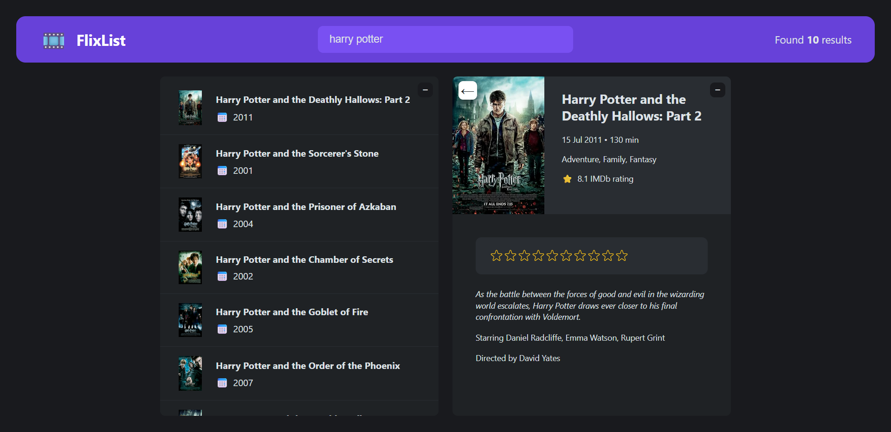
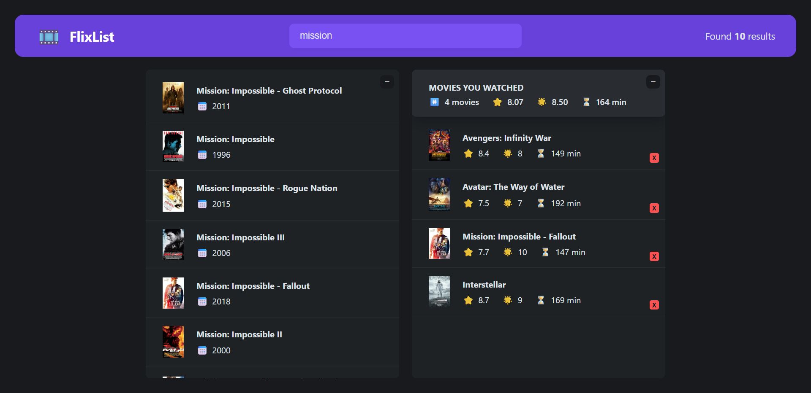

# 🎬 FlixList App

A movie search and rating app built with React, allowing users to search for movies, rate them, and track a personal watched list.

### 🌐 Live Demo

👉 [Try the live Application!](https://nkieu-flixlist-app.vercel.app/)

---

## 📸 Screenshots




---

## ✨ Features

- 🔍 **Search Movies**: Type any movie name to fetch results from the OMDb API.
- 📖 **View Details**: Click on a movie to view full details including plot, genre, actors, and IMDb rating.
- ⭐ **Custom Rating**: Rate each movie yourself using an interactive star rating component.
- 📃 **Watched List**: Save movies you’ve watched and rated into a personal list.
- 📊 **Summary Stats**: See the average IMDb rating, your average rating, and total runtime of watched movies.
- 🎹 **Keyboard Shortcuts**:
  - Press `Enter` to quickly focus the search bar.
  - Press `Escape` to close movie details.
- 🗃️ **Local Storage**: Watched movies persist between sessions using `localStorage`.

---

## 🧠 Learning Goals

This project was developed to deepen understanding of key React concepts:

- **Component Composition**: Structuring UI into modular, reusable components
- **React Hooks**:
  - `useState` for state management
  - `useEffect` for side effects and API calls
  - `useRef` for DOM manipulation and interaction tracking
- **Custom Hooks**:
  - `useMovies()` for fetching movie data
  - `useLocalStorageState()` for persisted state
  - `useKey()` for keyboard event handling
- **Conditional Rendering**: Toggle views based on state (e.g., show details vs watched list)
- **List Rendering & Keys**: Map through results and maintain efficient updates

---

### 🛠️ Technology Stack

| Tech           | Description                                 |
| -------------- | ------------------------------------------- |
| **React**      | JavaScript UI library (v18+)                |
| **JavaScript** | Modern JavaScript (ES6+)                    |
| **Vite**       | Fast build tool and development server      |
| **OMDb API**   | Movie data API used for fetching movie info |

---

## 🚀 Installation & Setup

1. **Clone the repository**

   ```bash
   git clone https://github.com/nkieu-config/flixlist-app-project.git
   ```

2. **Install dependencies**

   ```bash
   npm install
   ```

3. **Environment setup**

   Create a `.env` file in the root directory:

   ```env
   VITE_API_KEY=your_omdb_api_key_here
   ```

   🔐 **Get your free API key:** [OMDb API - The Open Movie Database](https://www.omdbapi.com/apikey.aspx)

4. **Start development server**

   ```bash
   npm run dev
   ```

⚠️ Requires Node.js and npm installed.

---

## 📚 Course Credit

This project was built as part of **[The Ultimate React Course 2025](https://www.udemy.com/course/the-ultimate-react-course/)** by [Jonas Schmedtmann](https://codingheroes.io/)

---

## 📃 License

This is a personal learning project and not intended for production use.
